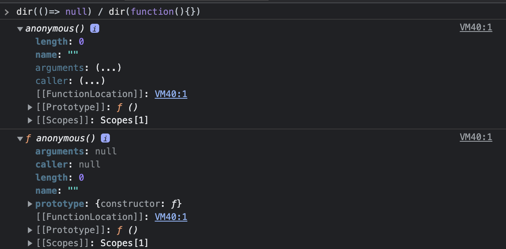

# 12. 함수

- 수학의 함수 : `입력`을 받아 `출력`을 내보내는 일련의 과정

## 12.1 함수란?

- 함수 : 일련의 과정을 문(statement)으로 구현하고 코드 블록으로 감싸서 하나의 실행 단위로 정의한 것
  - 입력을 받아서 출력을 내보냄

## 12.2 함수를 사용하는 이유

- 함수는 필요할 때 여러번 호출할 수 있다
- 실행 시점을 개발자가 결정할 수 있고 몇번이든 `코드의 재사용`이 가능하다
- 함수의 적절한 이름 -> 코드의 가독성 향상

## 12.3 함수 리터럴

```js
// 예제 12-4. 변수에 함수 리터럴을 할당
var f = function add(x, y) {
  return x + y;
};
```

- 함수 리터럴도 평가되어 값을 생성하며, 이 값은 객체다
  - 즉, 함수는 객체다

#### 함수의 리터럴의 구성요소

- 함수 이름
- 매개변수 목록
- 함수 몸체

- 함수 객체 vs 일반 객체
  - 일반 객체는 호출할 수 없지만 함수는 호출할 수 있다
  - 일반 객체에는 없는 함수 객체만의 고유한 프로퍼티를 갖는다
  - 18장 - 함수와 일급 객체에서 자세히 다룸

## 12.4 함수 정의

- 함수 정의 vs 변수 선언
  - 함수 선언문이 평가되면 식별자가 암묵적으로 생성되고 함수 객체가 할당된다

### 함수 선언문

```js
function add(x, y) {
  return x + y;
}
```

- 함수 리터럴과 형태가 동일, 함수 이름을 생략할 수 없다
- 표현식이 아닌 문이다.
- 선언문의 이름은 자바스크립트 엔진이 암묵적으로 식별자로 생성한다.

### 함수 표현식

```js
const func1 = function add(x: number, y: number) {
  return x + y;
};

// console.log("add", add(1, 2)); // TS2304: Cannot find name 'add'.
console.log("func1", func1(1, 2));
```

- function의 이름(add)를 붙이면 기명 함수 표현식
  - 생략하는 것이 일반적임

### 함수 생성 시점과 함수 호이스팅

- 호이스팅 : 코드의 선두로 끌어 올려지는 것 => 함수 호이스팅, 변수 호이스팅
  - 함수 선언문(함수 리터럴) : 호이스팅이 될 때 함수 내용도 같이 됨
    - 함수 호이스팅
  - 함수 표현식 : 호이스팅이 될 때 변수는 undefined로 초기화 되고, 변수에 함수가 할당되는 것은 할당되는 위치에서 할당 됨
    - 변수 호이스팅

### Function 생성자 함수

- new를 붙여서 실행한 생성자 함수는 클로저를 생성하지 않는 등 일반적인 함수와 다르게 동작한다.

### 화살표 함수

```js
const add = (x, y) => x + y;
console.log(add(2, 5)); // 7
```

- this바인당 방식이 다름
- prototype 프로퍼티가 없음
- **arguments 객체를 생성하지 않음**



- 26.3절에서 자세히 다룸

## 12.5 함수 호출

### 12.5.1 매개변수와 인수

### 12.5.2 인수 확인

- ES6 부턴 js에서도 함수 매개변수의 기본값을 지정할 수 있다.

```js
// ES6에서 매개변수의 기본값이 도입 됨
function add(x = 0, y = 1) {
  return x + y;
}

console.log(add());
```

### 12.5.3 매개변수의 최대 개수

- 매개변수가 많아진다면 객체를 인수로 전달하는 것이 유리하다
- 객체를 인수로 사용하는 경우 인수의 의미를 설명하는 프로퍼티 키를 사용하게 되므로 가독성도 좋아지고 실수도 줄어드는 효과가 있다

### 12.5.4 반환문

- `return` - 함수의 실행을 중단하고 함수 몸체를 빠져나간다
- return문 이후 코드는 무시 된다

## 12.6 참조에 의한 전달과 외부 상태의 변경

- 함수 매개변수로 전달한 객체를 함수안에서 조작을 하면 원본 객체에도 영향을 준다

```js
// 예제 12-33
var num = 100;
var person = { name: "Lee" };

function changeVal(primitive, obj) {
  primitive += 100;
  obj.name = "Kim";
}

changeVal(num, person);

console.log(num); // 100 - 원시 값은 원본이 훼손되지 않는다.
console.log(person); // {name: "Kim"} - 객체는 원본이 훼손된다.
```

- 객체의 변경을 추적 : 옵저버 패턴

  - https://ko.wikipedia.org/wiki/%EC%98%B5%EC%84%9C%EB%B2%84_%ED%8C%A8%ED%84%B4

- 객체를 변경 불가능한 값으로 동작하게 만드는 것 : 16.5.4 불변 객체 참고

## 12.7 다양한 함수의 형태

### 즉시 실행 함수

### 재귀 함수

- 탈출 조건을 반드시 만들어야 한다. - 없으면 스택 오버플로 에러가 발생
- 반복문을 사용하는 것보다 재귀함수를 사용하는 편이 더 직관적으로 이해하기 쉬울 때만 사용하자(웬만해선 사용하지 말자란 뜻)

### 중첩 함수

- 스코프, 클로저에 깊은 관련이 있음 - 나중에 살펴봄

### 콜백 함수

- 콜백함수 : 함수의 매개변수를 통해 다른 함수의 내부로 전달되는 함수
- 공통 로직을 미리 정의해 두고, 경우에 따라 변경되는 로직은 추상화해서 함수 외부에서 함수 내부로 전달
- 고차 함수 : 매개변수를 통해 함수를 전달 받거나 반환값으로 함수를 반환하는 함수
  - 고차함수는 매개변수를 통해 전달 받은 콜백 함수의 호출 시점을 결정해서 호출
- 콜백 함수는 고차함수에 의해 호출되며 이때 고차 함수는 필요에 따라 콜백 함수에 인수를 전달할 수 있다
- e.g., addEventListener

### 순수 함수와 비순수 함수

- 순수 함수 : 외부 상태에 의존하지 않고 변경하지도 않는, 즉, 부수 효과가 없는 함수
- 비순수 함수 : 외부 상태에 의존하거나 외부 상태를 변경하는, 즉 부수 효과가 있는 함수
- 외부 상태 : 전역변수, 서버데이터, 파일, Console., DOM 등

- 순수 함수의 특징
  - 인수를 전달 받지 않는 순수 함수는 언제나 동일한 값을 반환 : 상수와 마찬가지
  - 최소 하나 이상의 인수를 전달 받는다.
  - 인수의 불변성을 유지 - 인수를 변경하지 않음
  - 외부 상태를 변경하지 않는다
  - 어떤 외부 상태에도 의존하지 않으며, 외부 상태를 변경하지도 않는 함수가 순수 함수이다.

```js
// 순수 함수
var count = 0;
function increase(n) {
  return ++n;
}

// 비순수 함수
function increase() {
  return ++count;
}
```

- 함수형 프로그래밍 : 순수 함수와 보조 함수의 조합을 통해 외부 상태를 변경하는 부수 효과를 최소화해서 불변성을 지향하는 프로그래밍 패러다임

  - 로직 내 조건문, 반복문을 제거해서 복잡성을 해결
  - 변수 사용억제 - 생명주기를 최소화 - 상태 변경을 피해 오류를 최소화

- 자바스크립트 : 멀티패러다임 언어 - 객체지향 뿐만 아니라 함수형 프로그래밍을 적극적으로 활용
