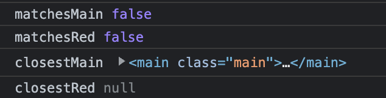

# 39. DOM

- 38장에서 알아본바와 같이 브라우저의 렌더링 엔진은 HTML문서를 파싱하여
- 브라우저가가 이해할 수 있는 자료구조인 DOM을 생성한다
- DOM(Document Object Model)
  - HTML 문서의 계층적 구조와 정보를 표현
  - 이를 제어할 수 있는 API
  - 즉, **프로퍼티와 메서드를 제공하는 트리 자료구조이다**

## 39.1 노드

### 39.1.1 HTML요소와 노드 객체

```html
<div class="greeting">Hello</div>
```

- 시작 태그 : `<div>`
- 어트리뷰트 이름 : `class`
- 어트리뷰트 값 : `"greeting"`
- 콘텐츠 : `Hello`
  - 다른 HTML 요소도 포함될 수 있음
- 종료 태그 : `</div>`

#### 트리 자료구조

- 부모 노드와 자식 노드로 구성되어 노드간의 계층적 구조(부자, 형제 관계)를 표현하는 비선형 자료구조
  - 루트 노드 : 최상위 노드
  - 리프 노드 : 자식 노드가 없는 노드
  - 비선형 자료 구조 : 하나의 자료 뒤에 여러개의 자료가 존재할 수 있는 구조 : 트리 or 그래프
    - 선형 자료 구조 : 하나의 자료 뒤에 하나의 자료만 존재하는 자료구조 : 배열, 스택, 큐, 링크드 리스트, 해시 테이블

### 39.1.2 노드 객체의 타입

- 총 12가지 종류 중 중요한 4가지
  - 문서 노드
    - HTML
  - 요소 노드
    - 문서의 구조, 부자 관계
  - 어트리뷰트 노드
    - HTML요소의 어트리뷰트를 가리키는 객체
  - 텍스트 노드
    - DOM트리의 최종단

### 39.1.3 노드 객체의 상속 구조

Object -> EventTarget -> Node

- Document
- Element -> HTMLElement -> HTMLDivElement, ...
- Attr
- CharacterData

  - Text
  - Comment

- 노드 객체 properties는 개발자 도구를 통해서도 확인 가능하다

- DOM API
  - 프로퍼티와 메서드 집합
  - window.document

## 39.2 요소 노드 취득

### id를 이용한 요소 노드 취득

- id 어트리뷰트 vs class 어트리뷰트

  - class는 하나의 어트리뷰트값에 여러개를 할당할 수 있지만(공백으로 구분)
  - id는 하나만 부여 가능
    - 띄어쓰기도 id의 string의 일부로 취급 됨
  - 단 HTML문서 내 같은 id를 가진 노드가 여러개 있어도 상관없다

- HTML요소에 id 어트리뷰트를 부여하면 id값과 동일한 이름의 전역변수가 암묵적으로 선언되고 해당 노드가 할당된다.

### CSS선택자를 이용한 요소 노드 취득

```js
const el = document.querySelector(".header__menu");
```

- getElementById가 querySelector보다 조금 더 빠르기 때문에 id로 가져올 땐 getElementById를 이용하자

- querySelectorAll 메서드는 DOM 컬렉션 객체, NodeList를 반환(유사 배열, 이터러블)

### 특정 요소 노드를 취득할 수 있는지 확인

Element.prototype.matches

- CSS 선택자를 통해 특정 요소 노드를 취득할 수 있는지 확인한다
- 이벤트 버블링을 통해 서칭 후 이벤트 위임

### HTMLCollection vs. NodeList

- HTMLCollection는 실시간으로 반영하는 live(살아있는) DOM 컬렉션 객체이다
  - getElementBy{something} : HTMLCollection을 반환
- NodeList

  - 대부분(?) 실시간이 아닌 과거 정적 상태를 유지(non-live객체)
  - querySelectorAll : NodeList를 반환

- 책의 예제 39-18 신기함 : live dom이 뭔지 확인 가능

#### NodeList

- non-live 객체이지만 `childNodes` 프로퍼티가 반환하는 NodeList 객체는 HTMLCollection 객체와 같이
  실시간으로 노드 객체 상태를 반영하는 `live 객체`로 동작
- 노드 객체의 상태 변경과 상관없이 안전하게 DOM 컬렉션을 사용하려면
  사용할 때 마다 Array.from 메서드를 사용하여 간단히 배열로 반환할 수 있다

#### live 객체 원리 추정

- 주소값이 직접 연결된(포인터) 참조 객체로 추정된다
  - 브라우저 엘리먼트와 DOM객체가 같은 객체를 바라고보 있어서 그런 것 같다
  - NodeList는 얕은 복사를 해서 1depth는 주소값이 다르지만 nested된 childNodes는 같은 주소를 바라보고 있어서 그런것으로 추정된다

## 39.3 노드 탐색

- parentNode, previousSibling, firstChild, childNodes는 Node.prototype이 제공
- previousElementSibling 같이 Element가 포함된 프로퍼티 또는 children 프로퍼티는 Element.prototype이 제공한다
  - 위 노드 탐색 프로퍼티는 setter 없이 getter만 존재하여 읽기는 가능하지만 쓰기는 무시된다

### 공백노드

- HTML문서의 가독성을 위해 포매팅하여 줄바꿈, 탭 등은 공백노드를 생성한다
  - 하지만 그렇다고 공백노드를 없애기 위해 가독성을 포기하는 것은 권장하지 않는다

### 자식 노드 탐색

- Node.prototype.childNodes
- Element.prototype.children
- ... 등

### 자식 노드 존재 확인

- Node.prototype.hasChildNodes

### 버블링하면서 찾기

- Element.closest()

```html
<main class="main">
  <ul id="colorList">
    <li class="red">red</li>
    <li class="blue">blue</li>
    <li class="green">green</li>
  </ul>
</main>
```

```js
const colorList = document.getElementById("colorList");

colorList.addEventListener("click", (event) => {
  const matchesMain = event.target.matches(".main");
  const matchesRed = event.target.matches(".red");
  const closestMain = event.target.closest(".main");
  const closestRed = event.target.closest(".red");

  console.log("matchesMain", matchesMain);
  console.log("matchesRed", matchesRed);
  console.log("closestMain", closestMain);
  console.log("closestRed", closestRed);
});
```

- Element.matches : EventTarget과 정확히 일치
- Element.closest : Bubbling되면서 자신을 포함, 부모노드로 올라가면서 일치하는 것을 찾음
- 
  - ul영역을 클릭했을 때
